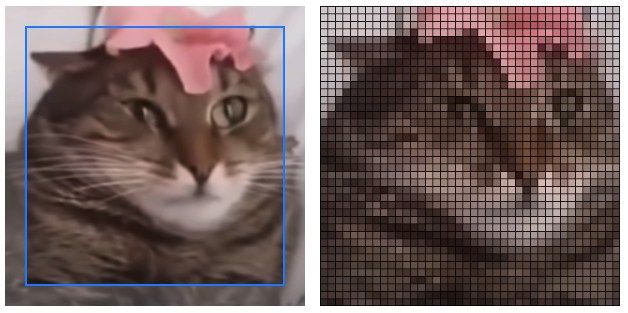

# mosaic

**Demo: [mosaic.marinm.net](https://mosaic.marinm.net)**

A graphics filter for pixelating (or tiling) blurry images to make them more recognizable. This effect is similar to the results of dithering, where random noise is added to low-quality photos to make them look better.



_Left image credit: @maxgoodrich Cat Transcendence on [YouTube](https://www.youtube.com/watch?v=IuysY1BekOE)_

## Usage

Start the server:

```
$ cd server
$ npm install
$ node server.js
```

## API

The client sends a base64-encoded image file (PNG, JPEG, BMP). Keep in mind the input file size limit.
```
{"file":"..."}
```

The server responds similarly with a base64-encoded PNG file:

```
{"result":"..."}
```

## Dependencies

* [Croppie](https://github.com/Foliotek/Croppie) for cropping a square from the original image
* [JIMP](https://github.com/oliver-moran/jimp) for image manipulation (pixelation, drawing black lines)